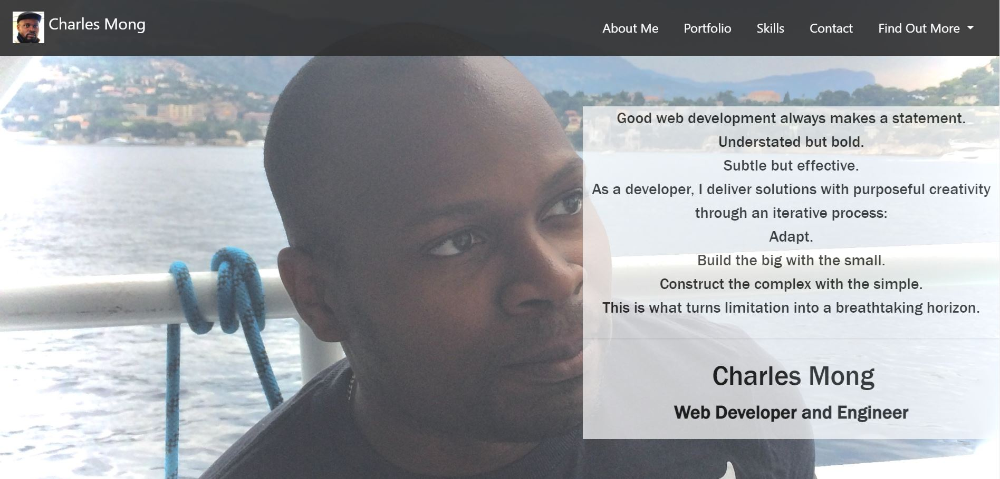
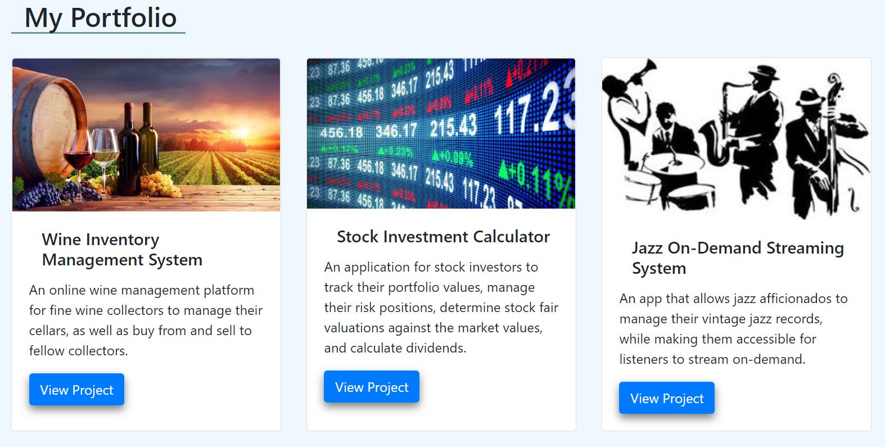
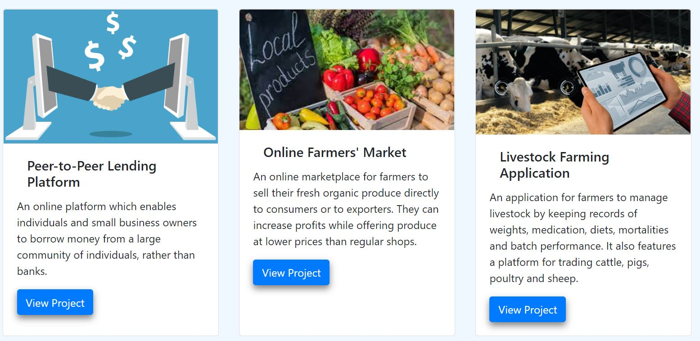
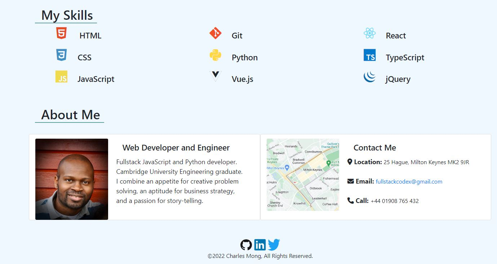

# Web Developer Bootstrap Portfolio - Charles Mong

## Description

Having previously created a web developer portfolio page using CSS Flexbox and Grid, I decided to recreate the same using the Bootstrap CSS Framework. I believe that this will be of a much higher quality, and will become the new point of reference for potential employers and collaborators in the future.

This will be a work in progress. It will give me a great chance to demonstrate the skills I have developed so far, as well as provide a springboard for future attempts at building more complex applications that solve problems and leverage technology.

## Acceptance Criteria

The following criteria are requisites for this portfolio are as follows:  

- A navigation menu with links to external sites and the appropriate sections within the page;  
- A hero section comprising a jumbotron with my photo, name and any other information or copy;  
- A work / portfolio section showcasing past projects with a brief description of each, created using Bootstrap cards;  
- A skills section;  
- An About Me and Contact Me section; and  
- A footer section.

For improved interactivity, all hyperlinks should have a hover effect, and all buttons should display a box shadow when hovered.

Using Bootstrap for this project should result in reduced usage of media queries. 

## Installation

The webpage was built using the Bootstrap CSS Framework to be responsive for all devices and all viewport widths.   

Within the "Portfolio" section, which showcases selected pieces of work from my portfolio, the images are clickable and will take you to the corresponding deployed application.

The site, linked below, was deployed using GitHub Pages.  

## Usage and Access

The webpage was built to create an optimised user experience across all device widths.

[Link to the deployed Bootstrap Portfolio website on GitHub Pages](https://ccmong.github.io/CMong-Bootstrap-Portfolio/)

[Link to the GitHub code repository](https://github.com/CcMong/CMong-Bootstrap-Portfolio)
  

## Licenses

N/A

## Badges

N/A

